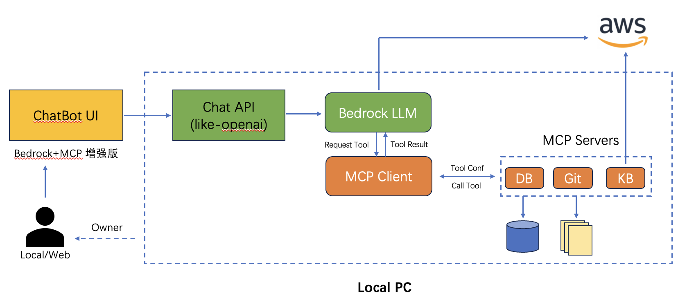

# ChatBot Enhanced by Bedrock+MCP

该项目提供基于 Bedrock 大模型的 ChatBot 交互服务，同时引入 [MCP 机制](https://www.anthropic.com/news/model-context-protocol)，极大增强并延伸 ChatBot 形态产品的应用场景，可支持本地文件系统、数据库、开发工具、互联网检索等无缝接入。如果说包含大模型的 ChatBot 相当于大脑的话，那引入 MCP 后就相当于装上了胳膊腿，真正让大模型动起来、跟各种现存系统和数据联通。

ChatBot 是大模型时代最常见的应用形态，可受限于大模型无法获取及时信息、无法操作外部系统等，使得 ChatBot 应用场景相对有限。后来随着 Function Calling/Tool Use 功能的推出，大模型能够跟外部系统交互，但弊端在于大模型业务逻辑和 Tool 开发都是紧密耦合的，无法发挥出 Tool 端规模化的效率。Anthropic 2024 年 11 月底推出的 MCP 打破了这一局面，引入整个社区的力量在 Tool 端规模化发力，目前已经有开源社区、各路厂商等开发了丰富的 [MCP server](https://github.com/modelcontextprotocol/servers)，使得 Tool 端蓬勃发展。终端用户即插即用就可将其集成到自己的 ChatBot 中，极大延展了 ChatBot UI 的能力，有种 ChatBot 一统各种系统 UI 的趋势。



<a href="https://glama.ai/mcp/servers/wdcuqdqtdb"></a>

该项目目前仍在不断探索完善，MCP 正在整个社区蓬勃发展，欢迎大家一起关注！

## 1. 依赖安装

目前主流 MCP Server 基于 NodeJS 或者 Python 开发实现并运行于用户 PC 上，因此用户需要安装这些依赖。

### NodeJS

NodeJS [下载安装](https://nodejs.org/en)，本项目已对 `v22.12.0` 版本充分测试。

### Python

除了有些 MCP Server 基于 Python 开发外，本项目相关代码也基于 Python 开发，因此需要安装环境和依赖。

首先，安装 Python 包管理工具 uv，具体可参考 [uv](https://docs.astral.sh/uv/getting-started/installation/) 官方指南，本项目已对 `v0.5.11` 版本充分测试。

## 2. 环境和配置

### 环境准备

下载克隆该项目后，进入项目目录中创建 Python 虚拟环境并安装依赖：

```
uv sync
```

此时项目目录的 `.venv` 中就创建好了虚拟环境。

### 配置编辑

项目配置写入 `.env` 文件，应包含以下配置项（建议拷贝 `.env_dev` 在其基础上修改）：

```
AWS_ACCESS_KEY_ID=<your-access-key>
AWS_SECRET_ACCESS_KEY=<your-secret-key>
AWS_REGION=us-east-1
LOG_DIR=./logs
CHATBOT_SERVICE_PORT=<chatbot-ui-service-port>
MCP_SERVICE_HOST=127.0.0.1
MCP_SERVICE_PORT=<bedrock-mcp-service-port>
```

备注：该项目用到 **AWS Bedrock Nova** 系列大模型，因此需要注册并获取以上服务访问密钥。

## 3. 运行

该项目包含两个服务：

- **Chat 接口服务（Bedrock+MCP）**，可对外提供 Chat 接口、同时托管多个 MCP server、支持历史多轮对话输入、响应内容附加了工具调用中间结果、暂不支持流式响应
- **ChatBot UI 服务**，跟上述 Chat 接口服务通信，提供多轮对话、MCP 管理的 Web UI 演示服务

### Chat 接口服务（Bedrock+MCP）

编辑配置文件 `conf/config.json`，该文件预设了要启动哪些 MCP server，可以编辑来添加或者修改 MCP server 参数。

每个 MCP server 的参数规范，可参考如下示例：

```
"db_sqlite": {
    "command": "uvx",
    "args": ["mcp-server-sqlite", "--db-path", "./tmp/test.db"],
    "env": {},
    "description": "DB Sqlite CRUD - MCP Server",
    "status": 1
}
```

启动服务：

```bash
sh start_mcp.sh
```

待启动后，可查看日志 `logs/start_mcp.log` 确认无报错，然后可运行测试脚本检查 Chat 接口：

```bash
# 脚本使用 Bedrock 的 Amazon Nova-lite 模型，也可更换其它
sh tests/test_chat_api.sh
```

### ChatBot UI 服务

启动服务：

```
sh start_chatbot.sh
```

待启动后，可查看日志 `logs/start_chatbot.log` 确认无报错，然后浏览器打开[服务地址](http://localhost:8502/)，即可体验 MCP 增强后的 Bedrock 大模型 ChatBot 能力。

由于已内置了文件系统操作、SQLite 数据库等 MCP Server，可以尝试连续提问以下问题进行体验：

```
show all of tables in the db
how many rows in that table
show all of rows in that table
save those rows record into a file, filename is rows.txt
list all of files in the allowed directory
read the content of rows.txt file
```


## 4. 添加 MCP Server

当前可以通过两种方式来添加 MCP Server：

1. 内置在 `conf/config.json` 中，每次重新启动 Chat 接口服务就会附带其中配置好的 MCP Server
2. 通过 ChatBot UI 来添加 MCP Server，通过表单提交 MCP Server 配置参数即可，仅当前生效、服务重启后失效

下面演示如何通过 ChatBot UI 添加 MCP Server，这里以 Web Search 供应商 [Exa](https://exa.ai/) 为例，开源社区已有针对它的 [MCP Server](https://github.com/exa-labs/exa-mcp-server) 可用。

首先，前往 [Exa](https://exa.ai/) 官网注册账号，并获取 API Key。

然后点击【添加 MCP Server】，在弹出菜单中填写如下参数并提交即可：


此时在已有 MCP Server 列表中就可以看到新添加项，勾选即可启动该 MCP Server。
